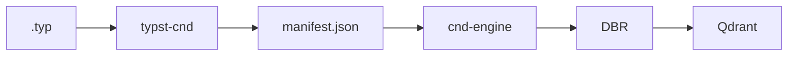

# typst + typst-cnd — Project Context

Reference map for contributors and AI agents working on the **typst-cnd** compiler inside this Typst workspace.

## What this workspace is

This directory is a **local clone of the Typst compiler** (v0.14.x workspace). It is the home of **`typst-cnd`**: a new exporter crate that compiles `.typ` sources into **CND Manifest JSON** for the Cosmyc / ctxnative pipeline.

| Piece | Location | Role |
|---|---|---|
| Typst compiler (upstream) | `crates/typst*`, `crates/typst-cli`, … | General-purpose typesetting |
| **typst-cnd** (to build) | `crates/typst-cnd/` | Typst → CND manifest JSON |
| CND consumer (separate repo) | `/home/maxence/ctxnative/cnd-engine` | Load manifest, chunk, DBR, Qdrant |
| Cosmyc product context | Notion wiki **CND** | Spec, engine, product vision |

**Do not** put CND emission logic in `cnd-engine` (Python). **Do not** patch `typst-layout` / `typst-eval` unless a public API gap forces it. Add a peer crate like `typst-html` and `typst-pdf`.

## End-to-end pipeline

```plain text
Typst source (.typ)
      │  typst-cnd (Rust, this workspace)
      ▼
CND Manifest (JSON)
      │  cnd-engine (Python)
      ▼
Chunks → DBR records → embedding → Qdrant
```



## Strategic context (Notion, June 2026)

Two strategies were documented in the [CND Notion wiki](https://www.notion.so/maxanox/36cc61707d5f800da28ac1f757e03270):

| Plan | Compilateur Typst | Format interne |
|---|---|---|
| Pivot DocLang | `typst-doclang` → `.dclg.xml` | DocLang pivot |
| **Alternative CND v2** (favored for this work) | **`typst-cnd`** → manifest JSON | CND v2 canonique |

**Current direction for this repo:** implement **`typst-cnd`** as the premium Typst on-ramp. DocLang remains a possible **interop boundary** for legacy PDF/DOCX ingestion — not the hot path for native Typst.

Key pages:
- [CND Standard](https://app.notion.com/p/37dc61707d5f8082b495d1fad337d087) — manifest schema, flags, refs
- [CND Engine](https://app.notion.com/p/37dc61707d5f80228ebada1dc7ace089) — what downstream expects
- [Alternative CND v2 + DocLang interchange](https://app.notion.com/p/37ec61707d5f81068ec8ea894a399bbc) — why typst-cnd stays central
- [Plan de transition DocLang](https://app.notion.com/p/37ec61707d5f815a9935c79c429b46bf) — context only; superseded for Typst path if CND v2 wins

## Where typst-cnd hooks into Typst

CND nodes are **not** built from the syntax AST (`typst_syntax::SyntaxNode`). They come from the **typed content tree after evaluation and realization** — the same layer `typst-html` uses.

Reference implementation to study:

```plain text
crates/typst-html/src/document.rs   → html_document(), realize()
crates/typst-html/src/convert.rs    → convert_to_nodes() — walk realized elements
crates/typst-pdf/src/lib.rs         → export after PagedDocument layout
crates/typst-cli/src/compile.rs     → World + typst::compile::<PagedDocument>
```

### Pipeline inside typst-cnd

```plain text
1. eval(main)           → Content (HeadingElem, ParElem, TableElem, …)
2. realize(Document)    → structured element pairs (see typst-html)
3. walk / convert       → CndNode tree (heading children, tables, …)
4. compile::<PagedDocument>  → layout + stable Introspector
5. join locations       → NodeLocation (page, span, …) per CND node
6. resolve refs         → refs_to / refs_from as NodeRef { id, label? }
7. serialize            → JSON manifest
```

| CND field | Typst source |
|---|---|
| `heading`, `paragraph`, `table` | `HeadingElem`, `ParElem`, `TableElem` after `realize` |
| `label` | Element labels (`<label>`) on the node itself |
| `refs_to` / `refs_from` | `NodeRef { id, label? }` — `@label` resolved via Introspector; label kept on the edge |
| `state_metadata` | Typst `State` / custom CND flags (`#cnd-table-hint(...)`, etc.) |
| `location` | `Introspector` + `PagedDocument` positions |
| `doc` | `DocumentInfo` (title, authors, lang, …) |
| `doc_hash` | SHA-256 of source `.typ` file |
| `heading_path` | Precomputed while walking heading tree |

## CND manifest contract (downstream)

The JSON schema is consumed by **cnd-engine** (`CndManifest` in `src/cnd_engine/core/manifest.py`, nodes in `nodes.py`).

Minimal valid fixture:

`/home/maxence/ctxnative/cnd-engine/tests/sources/minimal_manifest.json`

Top-level fields:

- `cnd_version` — spec version (e.g. `"0.1.0"`)
- `doc_hash` — content hash of source (manifest may also accept legacy `source_hash` on load in cnd-engine)
- `compiled_at` — ISO 8601 UTC
- `doc` — `DocMetadata` (title, authors, date, keywords, description, lang)
- `nodes` — tree of `heading` | `paragraph` | `table` | `quote` | `code` | `math` | `figure` | `list` (see cnd-engine)

**Cross-references:** each edge is `{ "id": "<uuid>", "label": "<typst-label>" }`. Chunkers and DBR use `id`; display and debugging use `label`.

**Validation loop:** emit JSON from typst-cnd → load with `CND.from_json()` in cnd-engine → `pytest` / `display_nodes()`.

## Planned crate layout

```plain text
crates/typst-cnd/
├── Cargo.toml
├── src/
│   ├── lib.rs
│   ├── document.rs       # CndManifest assembly
│   ├── emit/
│   │   ├── convert.rs    # realize → CndNode (pattern: typst-html/convert.rs)
│   │   ├── heading.rs
│   │   ├── paragraph.rs
│   │   ├── table.rs
│   │   └── refs.rs
│   └── location.rs       # Introspector Location → CND NodeLocation
└── src/bin/
    └── typst-cnd.rs      # CLI: typst-cnd compile doc.typ -o manifest.json
```

Workspace membership: `crates/*` is already in root `Cargo.toml` — adding `crates/typst-cnd/` is enough.

Optional later:
- `impl Output for CndDocument` (like `HtmlDocument` in `typst-html/src/dom.rs`)
- `typst-cli` integration: `typst compile -f cnd`

## Dependencies (expected)

Mirror `typst-html` / `typst-pdf` peers:

- `typst-library`, `typst-layout`, `typst-eval`, `typst-syntax`, `typst-utils`, `typst-macros`
- `serde`, `serde_json` for JSON export
- `clap` for CLI binary
- `comemo`, `ecow`, `rustc-hash` as needed

## Commands

```bash
cd /home/maxence/ctxnative/typst

# Build whole workspace (once typst-cnd exists)
cargo build -p typst-cnd

# Run CND compiler (once CLI exists)
cargo run -p typst-cnd -- compile path/to/doc.typ -o manifest.json

# Validate output against cnd-engine
cd /home/maxence/ctxnative/cnd-engine
uv run python -c "
from cnd_engine import CND
cnd = CND.from_json('../typst/path/to/manifest.json')
cnd.display_nodes()
"
```

## What's NOT in scope here

- Chunking, DBR, embeddings, Qdrant → **cnd-engine**
- DocLang export (`typst-doclang`) → separate effort unless interop is prioritized
- cosmyc-engine Docling pipeline → `/home/maxence/ctxnative/cosmyc-engine`
- Upstreaming typst-cnd to official Typst repo (ctxnative / Cosmyc specific for now)

## POC milestones

1. Scaffold `crates/typst-cnd/` with `Cargo.toml` and empty lib + bin
2. Compile a minimal `.typ` with one `heading` + one `paragraph`
3. Emit JSON that passes `CndManifest.model_validate_json()` in cnd-engine
4. Add `table` with cells + `location` from paged layout
5. Resolve `refs_to` / `refs_from` for `@label` references
6. Read `state_metadata` from CND Typst flags
7. Wire `doc_hash` + `DocumentInfo`

## Related repositories

| Path | Role |
|---|---|
| `/home/maxence/ctxnative/typst` | **This repo** — typst-cnd compiler |
| `/home/maxence/ctxnative/cnd-engine` | Python CND Engine — manifest consumer |
| `/home/maxence/ctxnative/cosmyc-engine` | Alternate DocLang-based indexing POC |

## For agents

When continuing work:

1. Read this file first.
2. Study `typst-html` before inventing a new walk — reuse `realize` + convert patterns.
3. CND nodes = **realized library elements**, not syntax tree nodes.
4. Keep typst-cnd changes in `crates/typst-cnd/`; avoid drive-by edits to upstream crates.
5. Validate every manifest against cnd-engine fixtures and Pydantic models.
6. Match manifest field names to cnd-engine (`doc_hash` in DBR maps from manifest `source_hash` / `doc_hash` — check current cnd-engine code).
7. Use `cargo` for Rust; do not add Python deps to this workspace.
